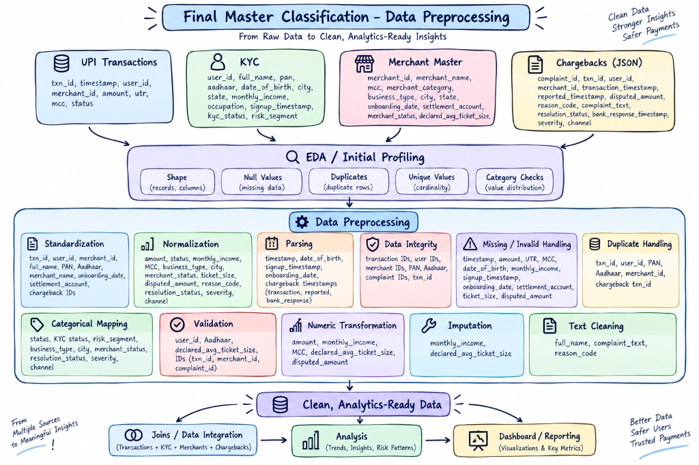
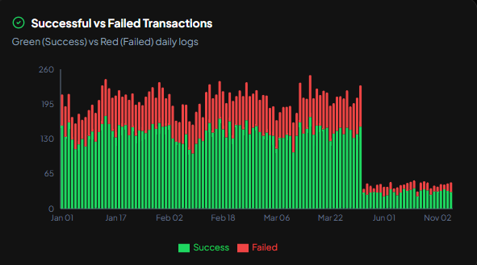
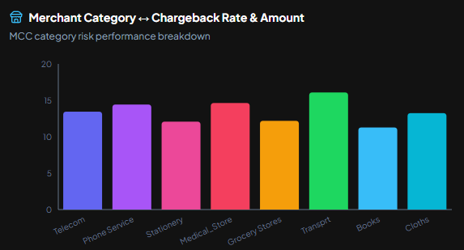
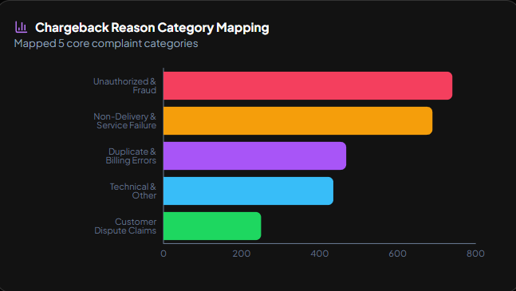
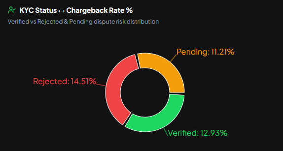

# Merchant Ring 

**Merchant Ring** is an interactive AI-powered FinTech & BFSI analytics dashboard designed for real-time UPI fraud ring detection, merchant risk profiling, and dispute monitoring and an integrated hands-free Voice AI Assistant.

---

## 📊 EDA & Data Preprocessing Workflow - [Access Notebook](./data-cleaned.ipynb)



Before deriving any analytical findings or building the dashboard, the raw dataset underwent a comprehensive EDA and data preprocessing pipeline in Google Colab (`data-cleaned.ipynb`):

1. **Data Parsing & Ingestion**: Parsed raw multi-source CSV and JSON files (transactions, merchant profiles, KYC logs, dispute records) into unified structured DataFrames.
2. **Data Integrity & Consistency Checks**: Audited missing values, removed duplicate transactions, validated foreign-key references across merchant/user IDs, and enforced schema integrity.
3. **Data Standardization**: Standardized transaction status categories (`SUCCESS`, `FAILED`, `PENDING`), merchant risk tiers, and date-time formats to consistent ISO standards across all 20,000+ records.
4. **Data Normalization & Scaling**: Applied log transformation and min-max scaling to continuous variables (transaction amounts, dispute frequencies) to prevent skewness in risk score calculations.
5. **Feature Engineering & Anomaly Detection**: Created engineered features such as chargeback-to-volume ratios, KYC risk scores, and repeat dispute velocity indicators to detect 128 fraud ring users.
6. **Dataset Packaging**: Exported the complete preprocessed dataset into structured JSON feeds (`fintech_processed_data.json` & `data_cleaned_notebook.json`), forming the foundational data layer from which all dashboard findings were extracted.

---

##  Features & Highlights

* **Overview & KPI Tracking**: Monitor total transaction volume (₹23.92 Cr), failure rates (29.18%), dispute ratios (12.91%), and KYC verification stats.
* **Merchant Risk & Fraud Hub**: Pinpoint high-risk merchant segments and track 128 repeat dispute users operating in organized fraud rings.
* **Interactive ML Notebook Viewer**: Integrated Google Colab style notebook viewer to inspect EDA, feature engineering, and data preprocessing code.
* **Hands-Free Voice AI Assistant**: Real-time speech recognition and natural female voice response that automatically updates chart visual colors per query.

---

##  Key Analytical Findings

After processing the full dataset, the following critical insights were identified:

* **High Chargeback Rate (12.91%)**: Totaled ₹63.18 Lakhs across 2,582 dispute cases out of ₹23.92 Cr processed volume—well above the 2.5% industry safety threshold.
* **Organized Fraud Rings**: Isolated **128 repeat dispute users** operating in coordinated fraud clusters targeting specific merchant categories.
* **KYC Non-Compliance Risk**: KYC-Rejected & Pending merchants exhibited the highest dispute rate (**14.51%**), proving unverified onboarding directly drives loss volume.
* **Transaction Failure Rate (29.18%)**: High technical failure rate (29.18%) paired with pending transactions (2.7%) linked to high dispute retry attempts.


###  Analytical Visualizations & Chart Insights

<div align="center">

<details open>
  <summary><b>📊 Click to Toggle Visualizations Gallery</b></summary>
  <br/>
  
  <table width="100%">
    <tr>
      <td width="50%" align="center">
        <h4>1. Successful vs Failed Transactions</h4>
        
        <p><i>Daily logs of green (success) vs red (failed) transactions</i></p>
      </td>
      <td width="50%" align="center">
        <h4>2. Merchant Category Chargebacks</h4>
        
        <p><i>MCC category risk performance breakdown</i></p>
      </td>
    </tr>
    <tr>
      <td width="50%" align="center">
        <h4>3. Chargeback Reason Mapping</h4>
        
        <p><i>Distribution across top 5 complaint categories</i></p>
      </td>
      <td width="50%" align="center">
        <h4>4. KYC Status vs Chargeback Rate %</h4>
        
        <p><i>Dispute risk: Rejected (14.51%), Pending (11.21%), Verified (12.93%)</i></p>
      </td>
    </tr>
  </table>

</details>

</div>

---

##  Repository Structure

```
Merchant-Ring/
├── assets/                         # Documentation assets & visualization charts
│   ├── data_preprocessing_workflow.jpg
│   ├── success_vs_failed_transactions.png
│   ├── merchant_category_chargebacks.png
│   ├── chargeback_reason_mapping.png
│   └── kyc_status_chargebacks.png
├── data-cleaned.ipynb              # Google Colab notebook (EDA & Preprocessing)
├── index.html                      # Entry HTML with page title & fonts
├── package.json                    # Dependencies and build scripts
├── vercel.json                     # Vercel deployment configuration
├── vite.config.js                  # Vite configuration
└── src/
    ├── App.jsx                     # Main application shell & tab routing
    ├── components/
    │   ├── AIAgentPanel.jsx        # Voice AI Assistant (Speech API & Voice Output)
    │   ├── NotebookModal.jsx       # Google Colab style foldable code viewer
    │   ├── DriveModal.jsx          # Dataset links modal
    │   ├── KPICards.jsx            # KPI cards component
    │   ├── SlicersBar.jsx          # Global filter controls
    │   └── sections/               # Tab sections (Overview, Risk, Fraud Hub)
    └── data/
        ├── data_cleaned_notebook.json # Formatted notebook JSON payload
        └── fintech_processed_data.json # Aggregated dataset metrics
```

---

##  Quick Setup

1. **Clone the repository**:
   ```bash
   git clone https://github.com/abinavgt/Merchant-Ring.git
   cd Merchant-Ring
   ```

2. **Install dependencies**:
   ```bash
   npm install
   ```

3. **Run development server**:
   ```bash
   npm run dev
   ```

4. **Build for production**:
   ```bash
   npm run build
   ```

---

##  Tech Stack
* **Model Building**: Google Colab
* **Frontend**: React, Tailwind CSS, Framer Motion, HTML
* **Visualizations**: Recharts, Lucide React Icons
* **Voice AI**: Web Speech API (Recognition & Synthesis)

